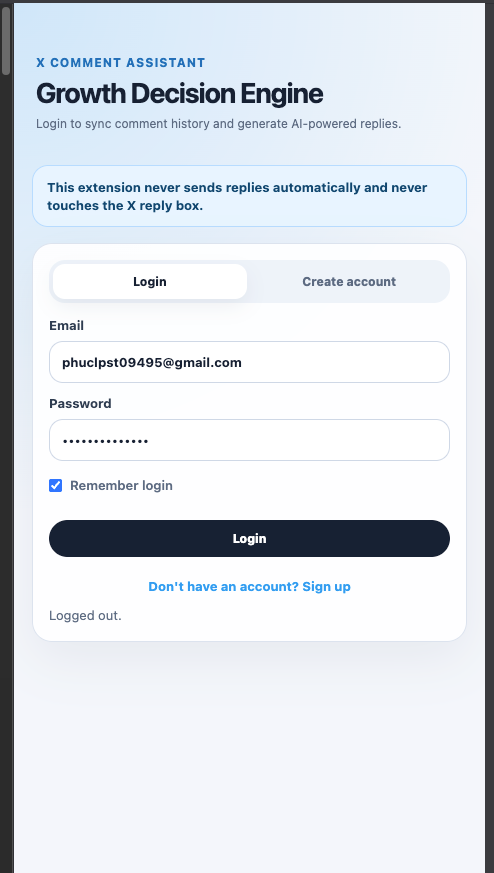
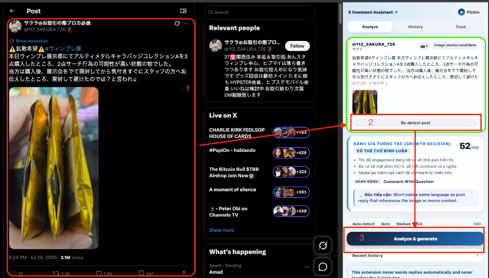
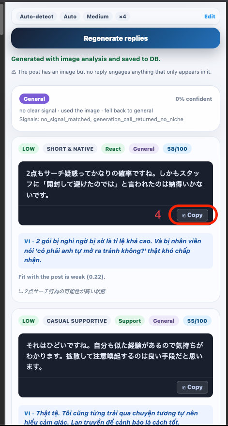
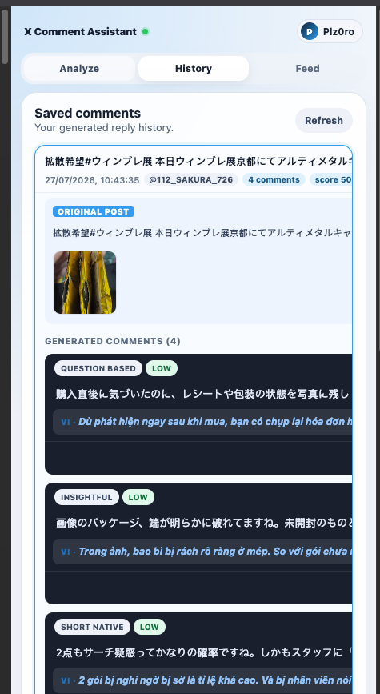
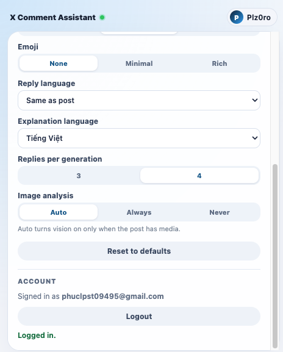

# X Comment Assistant

<p align="center">
  
  
  
  
</p>

---

**X Comment Assistant** is an AI-powered comment suggestion tool for X (formerly Twitter) integrated directly into a Chrome side panel. It automatically detects active posts, performs deep opportunity scoring and image/text intelligence, and generates optimized reply suggestions ready to be copied and pasted.

> [!IMPORTANT]
> **Safety First:** The extension operates on a **copy-only workflow**. It never performs automated DOM injections, never auto-pastes, and never automatically sends replies, ensuring your X account remains completely safe from automation flags.

---

## 📍 Quick Navigation

<p align="center">
  <a href="#features">✨ Features</a> •
  <a href="#-how-it-works-visual-guide">🌐 How It Works</a> •
  <a href="#architecture">🏗️ Architecture</a> •
  <a href="#project-structure">📂 Project Structure</a> <br>
  <a href="#quick-start">🚀 Quick Start</a> •
  <a href="#configuration">⚙️ Configuration</a> •
  <a href="#scripts">📜 Scripts</a> •
  <a href="#safety--privacy">🔒 Safety & Privacy</a> •
  <a href="#tech-stack">💻 Tech Stack</a>
</p>

---

## Features

| Feature | Description |
| :--- | :--- |
| **Post Detection** | Auto-detects posts via scroll, click, or navigation on x.com |
| **AI Reply Generation** | Generates context-aware, natural replies using OpenAI, DeepSeek, Gemini, Claude, or OpenRouter |
| **Image Understanding** | Full vision analysis for posts containing memes, charts, screenshots, or photos |
| **Niche Classification** | Categorizes posts into 20+ niches (tech, startup, anime, crypto...) with niche-specific safety filters |
| **Opportunity Scoring** | Analyzes posts across 9 dimensions (freshness, engagement potential, spam risk...) to score reply viability |
| **Feed Intelligence** | Scans visible feeds, batch-scores opportunities, and pinpoints the best posts to reply to |
| **Comment History** | Stores generated comments with clipboard copy tracking and user performance feedback |
| **Authentication** | Secure email/password login/register with persistent or browser-session temporary auth (Remember Login) |
| **i18n Support** | Fully localized interface supporting English (default) and Vietnamese |

---

## 🌐 How It Works (Visual Guide)

Follow this step-by-step visual workflow to use the Chrome Extension Sidepanel:

### 1. Authenticate (Register & Login)
Toggle between **Login** and **Create account** using the toggle button at the bottom of the form or the tabs at the top. Check **Remember login** to stay logged in permanently (if unchecked, you will be logged out when Chrome restarts).

<p align="center">
  
</p>

---

### 2. Select & Detect X Post
Open any post on [x.com](https://x.com) and click **Detect current X post** in the Sidepanel. The extension extracts the post content, runs visual analysis if media is present, and displays the **Opportunity Score (Growth Decision)**.

<p align="center">
  
</p>

---

### 3. Generate & Copy AI Replies
Select your desired niche, reply language, and tone. Click **Analyze & generate**. The Sidepanel will fetch 3-4 suggestions. Click **Copy** to copy a reply to your clipboard, then paste it manually into the X reply box.

<p align="center">
  
</p>

---

### 4. Review Comment History
Access the **History** tab to see all your previously generated comment packs, including original posts, safety ratings, niche classifications, and copied items.

<p align="center">
  
</p>

---

### 5. Customize Settings
Open the **Settings** tab to fine-tune your defaults: select emoji levels, preferred comment and explanation languages, suggestions count, or toggle image analysis behavior.

<p align="center">
  
</p>

---

## Architecture

```
┌──────────────────────────┐     ┌──────────────────────────────┐
│   Chrome Extension        │     │   NestJS API                 │
│                           │     │                              │
│  ┌─────────────────────┐  │     │  ┌────────────────────────┐  │
│  │ contentScript.ts    │──┼─────┼─►│ POST /api/v1/reply-packs│  │
│  │ (DOM detection)     │  │     │  │ POST /api/v1/analyze/   │  │
│  └──────────┬──────────┘  │     │  │ POST /api/v1/feed/      │  │
│             │             │     │  │ POST /api/v1/analytics/ │  │
│  ┌──────────▼──────────┐  │     │  └───────────┬────────────┘  │
│  │ sidepanel/App.tsx   │  │     │              │               │
│  │ (React UI)          │  │     │  ┌───────────▼────────────┐  │
│  └─────────────────────┘  │     │  │  AI Providers          │  │
│                           │     │  │  OpenAI / DeepSeek     │  │
│  ┌─────────────────────┐  │     │  │  Gemini / Claude       │  │
│  │ background.ts       │  │     │  │  OpenRouter            │  │
│  │ (service worker)    │  │     │  └────────────────────────┘  │
│  └─────────────────────┘  │     │                              │
└──────────────────────────┘     │  ┌────────────────────────┐  │
                                 │  │  MongoDB               │  │
                                 │  │  (analytics, history)   │  │
                                 │  └────────────────────────┘  │
                                 └──────────────────────────────┘
```

---

## Project Structure

```
x-comment-assistant/
├── apps/
│   ├── api/                    # NestJS 11 backend (194 source files)
│   │   ├── src/
│   │   │   ├── ai/             # Multi-provider AI (5 providers, vision, orchestration)
│   │   │   │   ├── providers/  # OpenAI, DeepSeek, Gemini, Claude, OpenRouter
│   │   │   │   ├── parsers/    # JSON repair, reply pack parsing
│   │   │   │   ├── prompt/     # System prompts for text + vision
│   │   │   │   └── orchestrator/
│   │   │   ├── modules/generations/  # Full reply-pack pipeline
│   │   │   │   ├── niche/           # 20 niche classifiers + policies + signals
│   │   │   │   ├── candidates/      # Candidate generation, strategy slots
│   │   │   │   ├── scoring/         # Empathy, diversity, rule scoring
│   │   │   │   ├── validation/      # Safety, factuality, duplicate detection
│   │   │   │   └── pipeline/        # Pipeline orchestrator
│   │   │   ├── comment-intelligence/  # AI harness + tool router
│   │   │   ├── analytics/           # Usage tracking, comment history
│   │   │   ├── feed-intelligence/   # Feed snapshot analysis
│   │   │   ├── opportunity/         # Post opportunity scoring engine
│   │   │   ├── vision/              # Image analysis
│   │   │   ├── auth/                # JWT auth
│   │   │   ├── common/              # Filters, interceptors, validation
│   │   │   └── infrastructure/      # Cache, DB
│   │   ├── test/
│   │   └── docs/ (removed — planning artifacts)
│   ├── extension/              # Chrome extension MV3 (21 source files)
│   │   ├── src/
│   │   │   ├── content/        # contentScript.ts + postExtractor.ts
│   │   │   ├── sidepanel/      # React UI (App.tsx, styles.css)
│   │   │   ├── shared/         # API client, types, settings, cache
│   │   │   └── i18n/           # Vietnamese + English
│   │   └── public/             # manifest.json
│   └── dashboard/              # React analytics dashboard (7 pages)
│       └── src/pages/          # Overview, Activity, History, Performance, …
├── packages/
│   └── opportunity-scoring/    # Shared scoring engine (API + extension)
└── pnpm-workspace.yaml
```

---

## Quick Start

### 1. Prerequisites
- **Node.js** 18+
- **pnpm** 9+
- **MongoDB** 7+ *(optional, only if you need local comment history)*
- **Chrome / Edge / Brave** (for extension sidepanel)

### 2. Install
```bash
git clone <repo-url>
cd x-comment-assistant
pnpm install
```

### 3. Configure API
```bash
cp apps/api/.env.example apps/api/.env
```
Edit `apps/api/.env` and set at least one AI provider API key:
```env
TEXT_AI_PROVIDER=deepseek
DEEPSEEK_API_KEY=sk-your-key-here

# Optional: for image/meme analysis
VISION_AI_PROVIDER=openrouter
OPENROUTER_API_KEY=sk-or-your-key-here
```
Also define the `JWT_SECRET` for authentication:
```env
JWT_SECRET=a-long-random-string-here
```

### 4. Start Backend API
```bash
cd apps/api
pnpm run start:dev
# Runs at: http://127.0.0.1:3001/api/v1
# Health check: curl http://127.0.0.1:3001/api/v1/health
```
> [!NOTE]
> Keep this backend terminal window running. The extension requires it to perform analysis and generate suggestions.

### 5. Build Chrome Extension
Open a **new terminal tab** and run:
```bash
cd x-comment-assistant
pnpm build:extension
```
This builds and compiles the extension files into `apps/extension/dist`.

### 6. Load Extension into Chrome
1. Navigate to `chrome://extensions` in Chrome.
2. Toggle **Developer mode** on (top-right).
3. Click **Load unpacked** (top-left).
4. Select the directory: `x-comment-assistant/apps/extension/dist`.
5. Pin the extension to your toolbar.

---

## Configuration

These variables can be set in `apps/api/.env`:

| Variable | Default | Description / Requirement |
| :--- | :--- | :--- |
| `TEXT_AI_PROVIDER` | `deepseek` | Model provider for text generation (`openai`, `deepseek`, `gemini`, `claude`, `openrouter`) |
| `VISION_AI_PROVIDER` | `openrouter` | Model provider for image/meme understanding |
| `DEEPSEEK_API_KEY` | — | API key for DeepSeek |
| `OPENAI_API_KEY` | — | API key for OpenAI |
| `GEMINI_API_KEY` | — | API key for Google Gemini |
| `CLAUDE_API_KEY` | — | API key for Anthropic Claude |
| `OPENROUTER_API_KEY` | — | API key for OpenRouter |
| `MONGODB_URI` | `mongodb://127.0.0.1:27017/x_comment_assistant` | Connection URI for the MongoDB analytics database |
| `JWT_SECRET` | — | Cryptographic secret used to sign JWT session tokens |

---

## Scripts

| Command | Description |
| :--- | :--- |
| `pnpm dev:api` | Start NestJS backend in hot-reload watch mode |
| `pnpm build:api` | Compile NestJS backend for production |
| `pnpm build:extension` | Compile Chrome Extension with Vite + TypeScript compiler |
| `pnpm test:api` | Run NestJS backend test suite (46 spec files) |
| `pnpm typecheck` | Perform type-checking across all workspaces |

---

## Safety & Privacy

- **Zero Automation:** The extension is copy-only. It does not automatically type into or submit forms on the X website.
- **Review Flow:** High-risk suggestions (such as controversial comments) are locked and non-copyable by default to prevent accidental violations.
- **Privacy First:** No personal browsing data is sent or recorded beyond the explicit post contents you analyze.
- **Model Decoupling:** All AI calls are tunneled through your own local server configurations, ensuring full control over API costs and logs.

---

## Tech Stack

| Component | Technologies |
| :--- | :--- |
| **Backend API** | NestJS 11, TypeScript 5.7 |
| **Database** | MongoDB 7 (native driver) |
| **AI Layer** | DeepSeek, OpenAI, Google Gemini, Anthropic Claude, OpenRouter |
| **Chrome Extension** | React 19, Vite 7, Chrome MV3 |
| **Analytics Dashboard** | React 19, Recharts 2 |
| **Localization** | i18next (English & Vietnamese) |
| **Data Validation** | class-validator, class-transformer |

---

## License

[MIT License](LICENSE)
